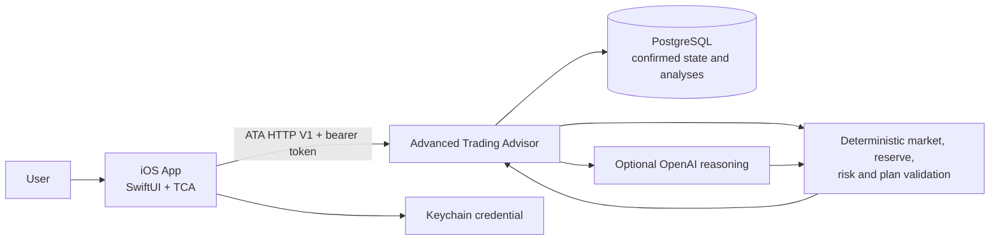
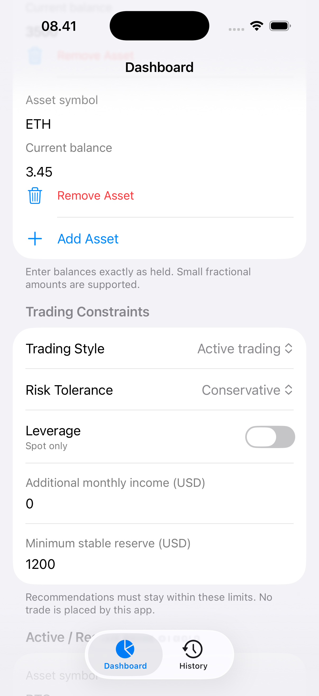
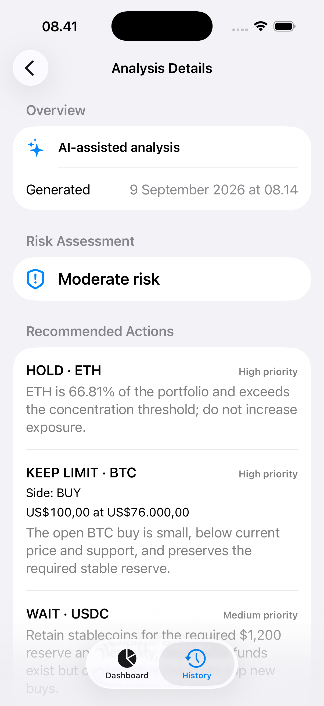
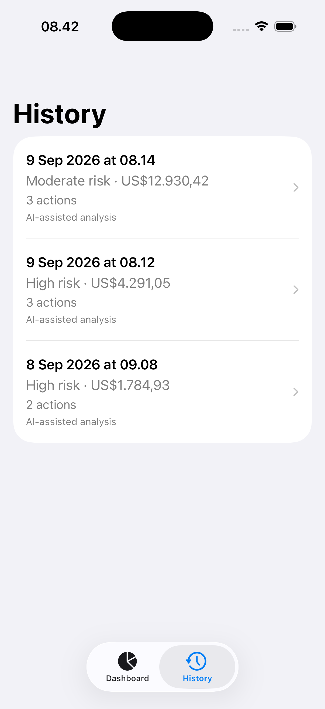

# CryptoPortfolioAdvisor

An iOS interface for a personal, spot-only crypto portfolio advisor. Advanced Trading Advisor
(ATA) is the authoritative backend and decision engine; this repository also retains the earlier
CryptoPortfolioAdvisor (CPA) prototype for reference and legacy tests.

**Active iOS stack:** Swift 6 · SwiftUI · TCA 1.26.2 · Keychain · authenticated ATA HTTP V1

> This is a portfolio/demo engineering project. It does not connect to exchanges, execute trades,
> provide leverage, or represent production financial advice.

## Current workflow

The Dashboard reads ATA's confirmed portfolio, accounts, financial settings, core-position
policies, and limit orders. Account, policy, and order edits use revision-checked ATA mutations;
only a complete server response replaces confirmed on-screen state. A filled external order is
recorded only after the user supplies its actual post-fill holdings. The app never places the
exchange order.

The History tab reads ATA's recent runs and dedicated latest completed analysis. Opening a run
loads its detail by run UUID, preserving that run's historical snapshot identity. Recommendations,
setups, and triggers are read-only decision support. ATA's scheduler produces analyses; the app
has no Analyze Now or automatic trading control.

## Why this project is technically interesting

- **One authority.** ATA owns confirmed portfolio and analysis state in PostgreSQL. The active
  iOS app neither restores nor caches that state in legacy SwiftData.
- **Explicit safety boundaries.** Expected revisions, one global mutation coordinator, server
  response replacement, and reconciliation after uncertain outcomes prevent optimistic or
  silently replayed writes.
- **Typed transport.** ATA DTOs map directly to ATA read models with exact decimal strings and
  strict enum handling; they do not pass through old CPA analysis models.
- **Modern concurrency.** Swift 6 strict concurrency, TCA dependencies, and `async`/`await` make
  reads, mutations, cancellation, and stale-response handling testable.
- **Separated credentials.** The ATA bearer token is held in Keychain, not Info.plist or source.
  Market data, AI, and deterministic risk validation belong to ATA, not iOS.

## Architecture



The active iOS feature layer depends on ATA domain values and injected async client/credential
capabilities. The `backend/` directory and older architecture/API documents describe the retained
CPA prototype, not the current ATA server. ATA lives in its separate repository.

## Key engineering decisions

| Decision | Rationale |
| --- | --- |
| SwiftUI + TCA | Makes feature state, navigation, effects, and dependency injection explicit and reducer-testable. |
| Swift 6 strict concurrency | Keeps asynchronous effects and credential access actor-safe without callback queues. |
| `Decimal`, not `Double` | Preserves exact financial values across the ATA transport and iOS domain boundary. |
| Server-confirmed mutations | Replaces on-screen state only with an ATA response for the expected revision. |
| Historical run identity | Keeps each analysis tied to its original run and snapshot, not the current Dashboard portfolio. |
| Backend-only decision logic | Keeps market data, AI, reserve/risk policy, and execution-validity checks out of iOS. |

## Reliability and safety

- There is no exchange connection, order execution, leverage control, or Analyze Now action.
- ATA portfolio writes are revision-checked; uncertain outcomes require reload and user review,
  never automatic mutation replay.
- Missing configuration, missing credentials, transport errors, and unauthorized responses are
  explicit UI states. Stale reads cannot replace newer accepted state.
- The bearer token lives in Keychain. No API key, token, or provider credential is in app source
  or Info.plist.
- Legacy CPA SwiftData and its client remain only for old source/tests and existing on-disk data;
  the active app does not open the store or connect to the CPA backend.

## Testing

- **iOS:** offline reducer, client, mapping, credential, security, and retained legacy tests cover
  the ATA cutover and historical CPA behavior.
- **ATA backend:** maintained and tested in its separate repository; it is not the `backend/`
  directory here.

The iOS unit suite uses fake clients and does not contact ATA, CoinGecko, OpenAI, or an exchange.

## Deployment

Set the non-secret `ATA_BACKEND_BASE_URL` build setting for the chosen Debug or Release build.
It is empty by default, producing an explicit configuration-unavailable state. Debug may target a
local ATA HTTP service; Release requires a non-local HTTPS ATA origin. Neither build uses a CPA URL
fallback. The user supplies the ATA bearer credential in the app, where it is stored in Keychain.

The older CPA FastAPI demo and its Render deployment remain in `backend/` and legacy documentation,
but are not connected to the active iOS app. Current ATA server deployment and PostgreSQL
operations are managed in the separate ATA repository.

## Earlier CPA prototype screenshots

These images document the earlier CPA demo interface, not the current ATA-backed Dashboard and
History.

<table>
  <thead>
    <tr>
      <th>Dashboard</th>
      <th>Analysis Details</th>
      <th>History</th>
    </tr>
  </thead>
  <tbody>
    <tr>
      <td align="center"></td>
      <td align="center"></td>
      <td align="center"></td>
    </tr>
    <tr>
      <td><sub>Balances, constraints, and manually tracked orders.</sub></td>
      <td><sub>Validated recommendations, risk, and analysis source.</sub></td>
      <td><sub>Earlier locally saved analysis history.</sub></td>
    </tr>
  </tbody>
</table>

## Repository structure

```text
CryptoPortfolioAdvisor/
├── ios/          # Active ATA-backed SwiftUI/TCA app plus retained CPA source/tests
├── backend/      # Earlier CPA FastAPI prototype, not the active iOS backend
├── contracts/    # Earlier CPA analysis schema
└── docs/         # Earlier CPA architecture, deployment, and presentation material
```

## Local setup

### Earlier CPA backend (not required for the active iOS app)

Requires Python 3.13. Local development defaults to static market data and in-memory idempotency,
so provider credentials are not required for the offline test suite.

```bash
cd backend
python3.13 -m venv .venv
source .venv/bin/activate
python -m pip install -e '.[dev]'
pytest
ruff check .
ruff format --check .
uvicorn app.main:app --reload
```

Runtime settings are documented in [`backend/.env.example`](backend/.env.example). Supply real
values only through local or hosting-platform environment variables; do not commit populated
environment files.

### iOS

Requires Xcode with Swift 6 and an iOS 18-or-later SDK.

```bash
cd ios
xcodebuild \
  -project CryptoPortfolioAdvisor.xcodeproj \
  -scheme CryptoPortfolioAdvisor \
  -destination 'platform=iOS Simulator,name=iPhone 17 Pro' \
  -skipMacroValidation \
  test
```

The normal scheme runs Debug; `CryptoPortfolioAdvisor-Release` runs Release for manual validation.
Neither scheme supplies an ATA endpoint until `ATA_BACKEND_BASE_URL` is configured. See the
[iOS guide](ios/README.md) for the active boundary and retained legacy-code details.

## Status

- The active iOS Dashboard and History have been cut over to authenticated ATA HTTP V1.
- The earlier CPA implementation and data remain available to legacy tests but are not app
  runtime authorities.
- Manual ATA environment configuration and credential entry are required before live use.
- App Store and TestFlight publication are outside this cleanup step.

The [iOS guide](ios/README.md) describes the active application. The older
[architecture](docs/architecture.md) and [API](docs/api.md) documents describe the CPA prototype.
