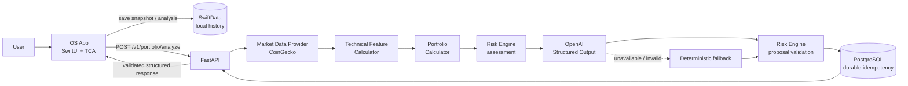

# CryptoPortfolioAdvisor

An iOS crypto portfolio advisor that combines deterministic portfolio and risk calculations with
validated, structured AI-assisted recommendations and immutable local history.

**Stack:** Swift 6 · SwiftUI · TCA 1.26.2 · SwiftData · FastAPI · PostgreSQL · CoinGecko · OpenAI
Structured Outputs · Render · Neon

> This is a portfolio/demo engineering project. It does not connect to exchanges, execute trades,
> provide leverage, or represent production financial advice.

## What it does

The daily workflow is deliberately explicit and user-controlled:

1. Enter current crypto and stablecoin balances.
2. Set trading constraints such as risk tolerance, reserve capital, and additional income.
3. Add manually placed limit orders and track them as open, filled, or cancelled.
4. Submit an immutable portfolio snapshot for analysis.
5. Receive calculated metrics, risk warnings, market context, and structured recommended actions.
6. Save the completed analysis on-device and revisit it through History and read-only details.

The app is advisory only. Updating an order or receiving a recommendation never changes a balance
or sends an instruction to an exchange.

## Why this project is technically interesting

- **Deterministic logic owns financial truth.** Portfolio valuation, allocations, available
  capital, technical features, and risk rules are implemented in code—not delegated to an LLM.
- **AI output is untrusted input.** OpenAI proposes typed actions over minimized context; the
  deterministic `RiskEngine` independently validates every proposal before it can reach iOS.
- **The contract is structured end to end.** Pydantic Structured Outputs, explicit DTO mapping,
  snake_case JSON, and API contract tests keep model, backend, and Swift boundaries aligned.
- **Retries are idempotent.** A stable snapshot UUID identifies one immutable request. PostgreSQL
  coordination preserves the completed response across retries, restarts, and workers.
- **Financial precision is explicit.** Swift and Python use `Decimal`; wire and persistence
  boundaries use canonical decimal strings instead of binary floating point.
- **Concurrency is modern and testable.** The iOS app uses Swift 6 complete concurrency checking,
  TCA dependency injection, `async`/`await`, actors, and no Combine-based business logic.
- **Failure is a designed state.** Bounded timeouts, typed errors, safe retry behavior, durable
  persistence, and deterministic AI fallback keep failures visible without fabricating results.
- **The full system is deployed.** A Release build has been exercised against Render, Neon,
  CoinGecko, and OpenAI through the complete save/history/details workflow.

## Architecture



The iOS feature layer depends on framework-independent Domain values and small async dependency
interfaces. Data implements networking and SwiftData boundaries. On the backend, routes map HTTP
DTOs, services orchestrate deterministic components, and infrastructure owns external providers
and PostgreSQL. See [Architecture](docs/architecture.md) and the
[API contract](docs/api.md) for the detailed boundaries.

## Key engineering decisions

| Decision | Rationale |
| --- | --- |
| SwiftUI + TCA | Makes feature state, navigation, effects, and dependency injection explicit and reducer-testable. |
| Swift 6 strict concurrency | Keeps asynchronous effects and SwiftData access actor-safe without callback queues. |
| `Decimal`, not `Double` | Avoids binary floating-point behavior across financial calculation and storage boundaries. |
| Immutable snapshots | Ensures a historical analysis always refers to the exact portfolio and constraints submitted. |
| Deterministic `RiskEngine` | Keeps policy enforcement reviewable and prevents AI output from becoming authoritative. |
| Structured LLM output | Constrains recommendations to typed, validated data rather than free-form operational commands. |
| Backend-only OpenAI key | Keeps credentials and model integration outside the distributed iOS binary. |
| Durable idempotency | Reuses a completed result for the same snapshot and detects conflicting payload reuse. |
| Graceful AI fallback | Returns clearly labelled deterministic analysis when model reasoning is unavailable or rejected. |
| Explicit network timeouts | Bounds CoinGecko, OpenAI, backend analysis, and iOS waiting while allowing for demo cold starts. |

## Reliability and safety

- There is no exchange integration, trade execution, or leverage execution.
- AI-proposed actions cannot bypass deterministic risk validation.
- Pydantic rejects malformed request shapes before analysis; Domain services enforce business
  invariants separately.
- Request retry reuses the same snapshot identity and payload rather than creating duplicate work.
- OpenAI and market-provider failures map to safe errors or a clearly identified deterministic
  fallback where possible.
- Logs and error responses exclude portfolio payloads, raw prompts, provider responses, and keys.
- Secrets are supplied through environment variables and are not stored in the repository or iOS
  application.

## Testing

- **iOS:** 108 passing tests covering reducers, Domain validation, SwiftData persistence, API DTOs,
  navigation, submission lifecycle, timeout/error mapping, and retry behavior.
- **Backend:** a comprehensive offline-first pytest suite covering portfolio calculation, technical
  features, risk filtering, structured AI output, provider failures, database idempotency, and API
  contracts.
- **Regression boundaries:** decimal-string serialization, nullable order fields, malformed
  responses, snapshot identity, idempotency conflicts, and fallback behavior have focused coverage.
- **Manual Release E2E:** verified from iOS Release → Render → CoinGecko → OpenAI → RiskEngine →
  Neon → iOS persistence → History → Details.

No normal automated test sends live CoinGecko or OpenAI traffic.

## Deployment

The portfolio staging environment uses:

- **Render Free** for the FastAPI service. It may cold-start after idle, so bounded client and
  backend timeouts account for demo wake-up latency.
- **Neon PostgreSQL** for durable analysis idempotency.
- **CoinGecko Demo/live market data** for current prices and OHLC history; technical indicators are
  calculated by backend code.
- **OpenAI** from the backend only, using Structured Outputs and minimized calculated context.
- An HTTPS-only iOS Release endpoint:
  [`https://crypto-portfolio-advisor-api.onrender.com`](https://crypto-portfolio-advisor-api.onrender.com).

Debug continues to use `http://127.0.0.1:8000`. Non-Debug builds require HTTPS and reject HTTP and
loopback hosts. Deployment configuration, migrations, health checks, cleanup, and verification are
documented in [Deployment](docs/deployment.md) and the
[deployment runbook](docs/deployment-runbook.md).

## Screenshots

<table>
  <thead>
    <tr>
      <th>Dashboard</th>
      <th>Analysis Details</th>
      <th>History</th>
    </tr>
  </thead>
  <tbody>
    <tr>
      <td align="center"></td>
      <td align="center"></td>
      <td align="center"></td>
    </tr>
    <tr>
      <td><sub>Balances, constraints, and manually tracked orders.</sub></td>
      <td><sub>Validated recommendations, risk, and analysis source.</sub></td>
      <td><sub>Immutable completed analyses saved locally.</sub></td>
    </tr>
  </tbody>
</table>

## Repository structure

```text
CryptoPortfolioAdvisor/
├── ios/          # SwiftUI/TCA app, Domain models, URLSession client, SwiftData, tests
├── backend/      # FastAPI service, calculators, RiskEngine, providers, persistence, tests
├── contracts/    # Platform-neutral structured analysis JSON schema
└── docs/         # Architecture, API, deployment, privacy, and release documentation
```

## Local setup

### Backend

Requires Python 3.13. Local development defaults to static market data and in-memory idempotency,
so provider credentials are not required for the offline test suite.

```bash
cd backend
python3.13 -m venv .venv
source .venv/bin/activate
python -m pip install -e '.[dev]'
pytest
ruff check .
ruff format --check .
uvicorn app.main:app --reload
```

Runtime settings are documented in [`backend/.env.example`](backend/.env.example). Supply real
values only through local or hosting-platform environment variables; do not commit populated
environment files.

### iOS

Requires Xcode with Swift 6 and an iOS 18-or-later SDK.

```bash
cd ios
xcodebuild \
  -project CryptoPortfolioAdvisor.xcodeproj \
  -scheme CryptoPortfolioAdvisor \
  -destination 'platform=iOS Simulator,name=iPhone 17 Pro' \
  -skipMacroValidation \
  test
```

The Debug scheme connects to the local backend at `127.0.0.1:8000`. The shared
`CryptoPortfolioAdvisor-Release` scheme runs the existing HTTPS Release configuration for manual
staging validation. See the [iOS guide](ios/README.md) for build and architecture details.

## Status

- Core development is complete.
- The production-style portfolio/demo deployment is working on Render and Neon.
- The full Release end-to-end workflow has been manually verified.
- App Store and TestFlight publication are intentionally outside the current portfolio scope.

Further technical detail is available in the [architecture](docs/architecture.md),
[API](docs/api.md), [privacy data flow](docs/privacy-data-flow.md), and
[release checklist](docs/release-checklist.md).
